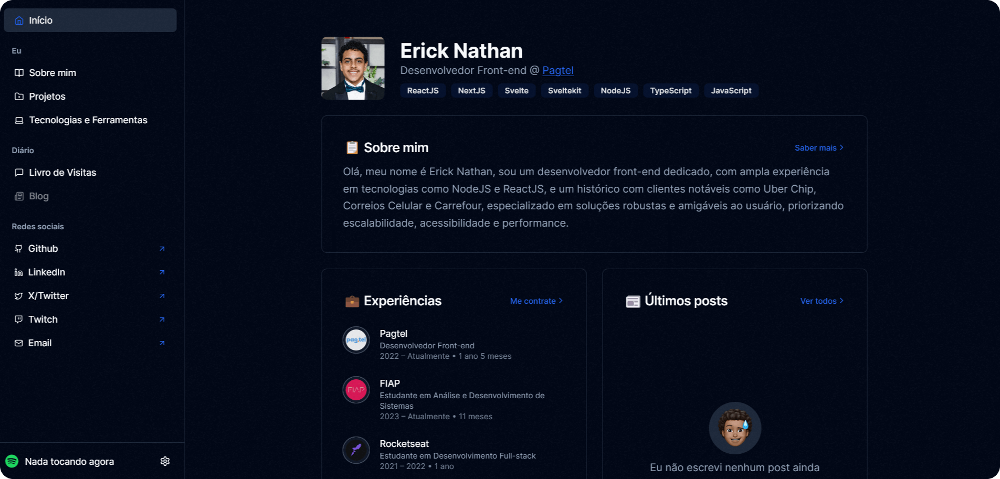

# ericknathan.me    

[🇺🇸 Don't speak Portuguese? Click here to view the english version.](./README-EN.md)

Bem-vindo ao meu site pessoal 😎! Ele foi projetado para exibir meu portfólio, projetos e compartilhar um pouco sobre quem eu sou. Você pode visitá-lo em [ericknathan.me](ericknathan.me). Orgulhosamente feito com [React](https://react.dev), [NextJS](https://nextjs.org) e [TailwindCSS](https://tailwindcss.com), hospedado na [Vercel](https://vercel.com).
  
